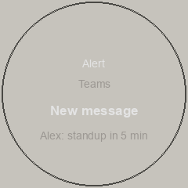

# Live Mac notifications on the clock

When a notification arrives on your Mac, the clock can **switch to an alert screen for 15 seconds**, then return to whatever page it was showing (clock, weather, Spotify, or network).

<p align="center">
  
</p>

## Requirements

- Clock on **Wi-Fi** (same network as your Mac)
- Firmware with `/notify` HTTP endpoint (current `main` branch)
- Mac helper: `notification_forward.py` or **Apple Shortcuts** (recommended)

USB hotkeys (page/rotate) are separate; notifications use **Wi-Fi HTTP** because message text can be long.

## 1. Save the clock IP

On the clock **Network** page, note the LAN IP, then:

```bash
~/Library/Application\ Support/esp32-round-clock/.venv/bin/python3 \
  ~/Library/Application\ Support/esp32-round-clock/send_page.py --save-host 192.168.1.42
```

## 2. Flash firmware

```bash
./scripts/stop-hotkeys.sh
pio run -e esp32c3_round -t upload
./scripts/install_usb_daemon.sh
```

## 3. Test from Mac

```bash
~/Library/Application\ Support/esp32-round-clock/notification_forward.py test
```

The clock should show an alert for **15 seconds**, then return to the previous page.

Manual curl:

```bash
curl -s -X POST "http://esp32-clock.local:8080/notify" \
  -H "Content-Type: application/json" \
  -d '{"app":"Teams","title":"New message","body":"Alex: hello"}'
```

## 4. Forward real notifications

### Option A — Apple Shortcuts (most reliable)

macOS does not expose a stable public API for all notification apps. Shortcuts is the dependable approach.

1. Open **Shortcuts** → **Automation** → **+** → **Notification**
2. Choose **Any App** (or pick Teams, Outlook, Messages, etc.)
3. Add action **Run Shell Script** (shell: `/bin/zsh`, pass input as arguments)
4. Script:

```bash
"$HOME/Library/Application Support/esp32-round-clock/forward-notification.sh" "$1" "$2" "$3"
```

Shortcut input mapping varies by macOS version; you may need to pass **Shortcut Input** / notification fields into `$1` `$2` `$3`. Test with one app first (e.g. Messages).

Duplicate automations per important app if “Any App” is not available.

### Option B — Background log watcher (experimental)

```bash
cd ~/Documents/esp32-round-clock
./scripts/install_notification_forward.sh
```

This runs `notification_forward.py watch` at login and tries to parse `log stream` lines. It works for some macOS versions and may miss or mis-label alerts. Check:

`~/Library/Application Support/esp32-round-clock/notification-forward.log`

## Behaviour on the clock

| Event | Action |
|--------|--------|
| POST `/notify` | Show alert overlay (app, title, body) |
| 15 seconds | Auto-return to previous page |
| BOOT tap during alert | Dismiss alert and return early |
| New alert while showing | Reset 15s timer and update text |

## JSON API

`POST http://<clock-ip>:8080/notify`

```json
{
  "app": "Teams",
  "title": "New chat message",
  "body": "Project standup in 5 min"
}
```

GET also works for quick tests:

`http://esp32-clock.local:8080/notify?app=Mail&title=Hello&body=World`  
(URL-encode spaces.)

## On-screen text

- **Title** and **body** use a single line each. If the text is wider than the display, it **scrolls horizontally** (same style as the Spotify track name).
- Short text stays **centered** without scrolling.

## Limitations

- **FaceTime / Phone calls** may need separate Shortcuts automations (Call notifications differ by macOS).
- **Do Not Disturb / Focus** may block notifications before they reach the Mac forwarder.
- Very long messages are truncated when stored on the device (title ~43 chars, body ~79 chars) before scrolling.
